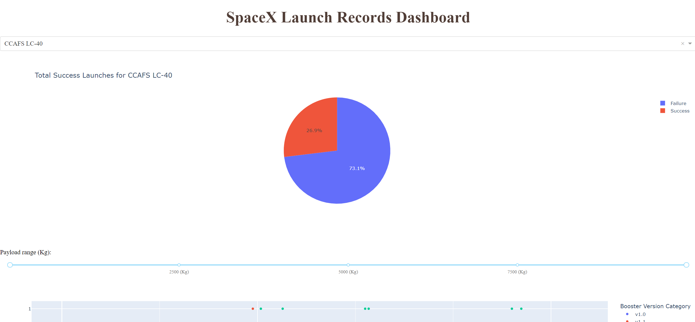
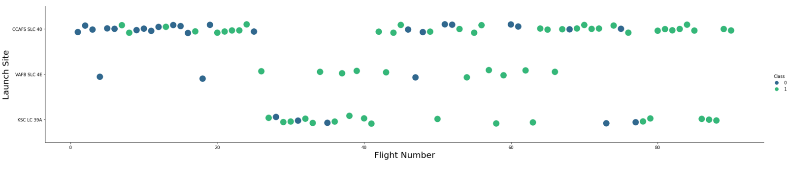
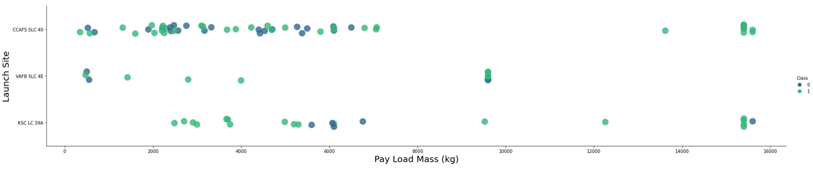
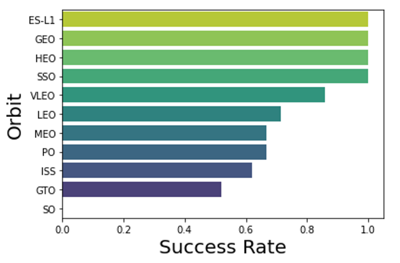
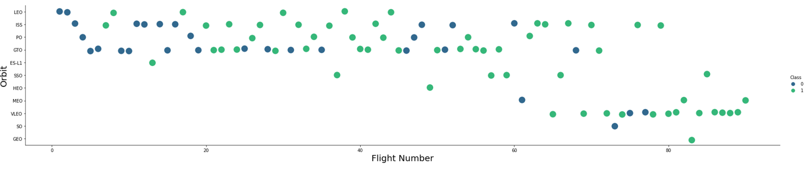
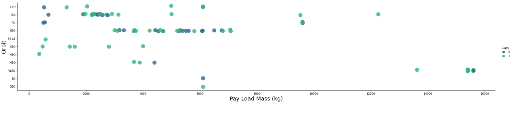
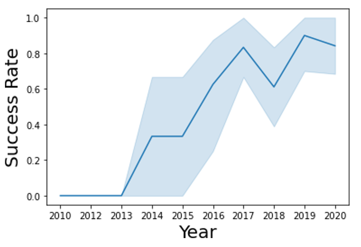
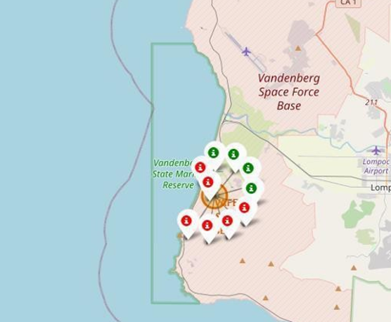
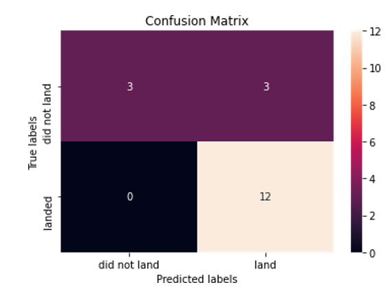

# IBM-Data-Science-project
Prediction analysis of SpaceX by creating and optimizing different machine learning algorithm on IBM Watson cloud using SpaceX API and presented reports in the form of interactive dashboard and visual analytics 

## Technologies
- Cloud (IBM Watson)
- SQL for exploratory data analysis
- API to connect cloud database with Python
- Machine learning algorithm
   - Logistic Regression
  - Support Vector  Machine
  - Decision Tree Classifier
  - K Nearest Neighbors
- Optimization of model through hyper parameter tuning using grid search
- Python
- Visualization (plots, charts, map) and reporting
- Interactive dashboard (Plotly dash)
- Git
- Web scraping (HTML parsing)
## Outline 
- [Executive Summary](#Executive-Summary)
- [Introduction](#Introduction)
- [Methodology](#Methodology)
- [Results](#Results)
- [Conclusion](#Conclusion)

## Executive Summary
- Data for this were collected from SpeceX API and Wikipedia page of SpaceX. Data were sampled for classification whether landing was successful or not. Exploratory analysis were done using SQL. For detailed analysis visualization were done in folium map and dashboards.
- Prediction analysis were done on four machine learning algorithm to select best accurate model by hyper tuning model using grid search. 
Models:
  - Logistic Regression
  - Support Vector  Machine
  - Decision Tree Classifier
  - K Nearest Neighbors
- Accuracy of all models were between 80 % to 85 % which can be considered good.
## Introduction
Background
- With the commercialization of space, there is going to be huge competition in space market considering investment, pricing and strategy
- Possible due to ability to recover part of rocket from stage I
- Hypothetical space company analysis to present scenario to compete with SpaceX
Problem
- Prediction of successful stage I recovery by training model on machine learning classification algorithm
## Methodology
- Data collection methodology:
  - Integration of data from SpaceX API and data collected from scrapping wikipedia
- Perform data wrangling
  - Classifying successful landing as successful and other as unsuccessful
- Perform exploratory data analysis (EDA) using visualization and SQL
- Perform interactive visual analytics using Folium and Plotly Dash
- Perform predictive analysis using classification models
- Hyper parameters of model were tuned using grid search
## Data Collection
- Data were extracted using two method and sources:
  - Extracted from SpaceX API and then conversion of result from json to dataframe using pandas
  - Web scrapping was done to extract data from Wikipedia page of SpaecX using request and beautifulsoup library in python
- SpaceX API Data columns
FlightNumber, Date, BoosterVersion, PayloadMass, Orbit, LaunchSite, Outcome, Flights, GridFins, Reused, Legs, LandingPad, Block, ReusedCount, Serial, Longitude, Latitude
- Wikipedia Data columns
Flight No., Launch site, Payload, PayloadMass, Orbit, Customer, Launch outcome, Version  Booster, Booster landing, Date, Time

## Data collection Space-X API
Data collection approach (API)

[Jupyter notebook](https://github.com/hamzahshabbir96/IBM-Data-Science-project/blob/master/Project%20mission%20space.ipynb)

Data collection approach Web scraping

[Jupyter notebook](https://github.com/hamzahshabbir96/IBM-Data-Science-project/blob/master/Data%20collection%20with%20web%20scraping.ipynb)

## Data wrangling
- Creation of data column with training label with outcomes where successful is mapped with 1 and failure with 0
- Outcome has columns mission outcome and landing location
- Mapping of different features with True in it with 1 and all other with 0
[Jupyter notebook](https://github.com/hamzahshabbir96/IBM-Data-Science-project/blob/master/Data%20wrangling.ipynb)
## Exploratory data analysis with Data visualization
- Carried out Exploratory data analysis on different relations of data column
- Different types of plot such as scatter plot, line plot and bar plots were used to see relationship between different variables and to see trend 
[Jupyter notebook](https://github.com/hamzahshabbir96/IBM-Data-Science-project/blob/master/EDA%20with%20Data%20visualization.ipynb)

## Exploratory data analysis with SQL
- Data were loaded and stored into IBM DB2 database on cloud
- Ran different queries by integrating SQL API with Python
- Different analysis were done using queries such as mission outcomes, various payloads size of customers etc. get deep understanding of data
[Jupyter notebook](https://github.com/hamzahshabbir96/IBM-Data-Science-project/blob/master/EDA%20with%20SQL.ipynb)

## Build an Interactive Map with Folium
Applied folium library to build an interactive map with information such as Launch sites , successful and unsuccessful landing with nearby location such as Railway, highway etc
[Jupyter notebook](https://github.com/hamzahshabbir96/IBM-Data-Science-project/blob/master/Interactive%20Visual%20Analytics.ipynb)

## Build a Dashboard with Plotly Dash
- Using plotly dash created an interactive dashboard where user have option to select certain parameter.
- Scatter plot takes input in the form of drowpdown with All site or individual site as options. Other input is a slider to select payload mass between 0 and 10000 kg.
- Pie chart created to visualize success rate
[go to file](https://github.com/hamzahshabbir96/IBM-Data-Science-project/blob/master/dash.py)

## Predictive Analysis (Classification)
[Jupyter notebook](https://github.com/hamzahshabbir96/IBM-Data-Science-project/blob/master/Machine%20learning%20prediction.ipynb)

## Results

### Flight Number vs. Launch Site
plot show relation of launch site with flight number. It can be concluded that CCAFS SLC 40 has maximum number of launch

### Payload vs. Launch Site

Plot shows relation between launch site and payload where green dot shows successful launch and blue dot shows unsuccessful launch

### Success Rate vs. Orbit Type

### Flight Number vs. Orbit Type

### Payload vs. Orbit Type
Plots shows relation of orbit with payload
ISS having high payload resulted into successful launch
Size of pyload doesnot mean unsuccessful launch

### Launch Success Yearly Trend
Plot shows trend in success rate, it shows success rate has improved significantly in recent years

### Launch site location

Above map shows launch site location in the form of circle

### Launch markers
Green color shows successful landing and red color shows unsuccessful landing

### Pie chart for successful launches

Above pie chart shows successful and unsuccessful launches

### Confusion Matrix
Model predicted 12 successful landing when there was actual landing.
There was also false negative of 3 set
Predicted accurately number of unsuccessful land

## Conclusions
- Produced interactive dashboard and visual analysis to conclude some of the important trends
- Model successfully predicted if landing will be successful with great accuracy
- Machine learning model with accuracy of 82% was developed
- Through this model we can find out whether launch should be made or not
- Having more data will make model more accurate

